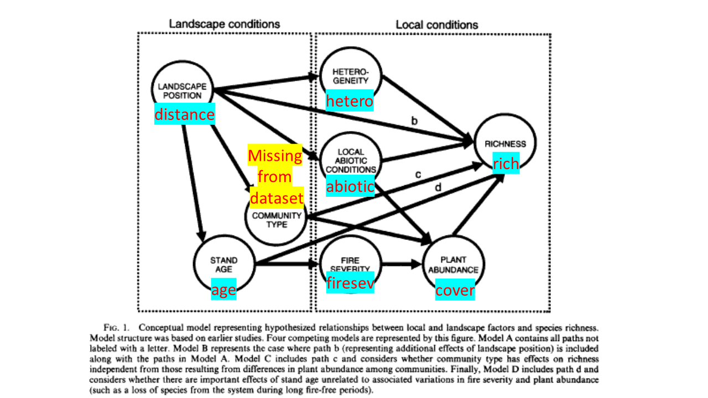

### Introduction

The goal of this document is to reproduce some of the analyses and figures in Grace & Keeley 2006, a paper that uses structural equation models (SEMs) to study how fires affect different aspects of plant communities, particularly species richness.  The authors used frequentist methods but here I will try frequentist and Bayesian methods.  The authors do a good job of highlighting the main steps to creating SEMs throughout the paper, and I've quoted some of that material throughout the document.

Note: [I am also straight up stealing some of this from Jarrett](https://rpubs.com/jebyrnes/brms_bayes_sem)


### Create a conceptual model of your system using *a priori* knowledge

> "The modeling process in SEM is guided by the investigator’s a priori and theoretical knowledge and begins with a consideration of expected relationships based on mechanisms thought to operate in the system... In particular, we related spatial variations in richness to four kinds of local factors: (1) fire severity, (2) the recovery of plant abundance, (3) local abiotic conditions, and (4) within-plot spatial heterogeneity (Fig. 1)." (Grace & Keeley 2006, p. 504)


These factors are shown in a conceptual model, which I have (sort of) recreated below using *dagitty*:

```{r, warning = FALSE, message = FALSE}

library(piecewiseSEM)
library(brms)
library(dagitty)
library(ggdag)


figure_1 <- dagitty( "dag {
                     LandscapePosition -> StandAge -> FireSeverity -> PlantAbundance -> Richness
                     LandscapePosition -> CommunityType -> PlantAbundance -> Richness
                     LandscapePosition -> CommunityType -> Richness
                     LandscapePosition -> StandAge -> Richness
                     LandscapePosition -> LocalAbioticConditions -> PlantAbundance -> Richness
                     LandscapePosition -> LocalAbioticConditions -> Richness
                     LandscapePosition -> Richness
                     LandscapePosition -> Heterogeneity -> Richness
                     }")

plot(figure_1) #can plot repeatedly to get different layouts


```

I was excited to find *dagitty* and *ggdag*, and I think both packages have some functions that are probably useful (more for qualitative analyses), but it seems to be a bit of a pain to use for creating publication-worthy figures.  It would probably be easier to work in a program like Photoshop or Inkscape.


### Relate observed variables to your conceptual model


> Following the development of a conceptual model to guide the modeling process, the next step in the SEM process relates observed variables to the relevant
 constructs (the term "construct" refers to the conceptual units in structural equation models) in order to form the complete structural equation model. The complete structural equation model represents a specific architecture that can include latent variables (which represent hypothesized but unmeasured factors), observed variables, and sometimes composite variables (which represent combinations of variables). Observed variables that serve as measures of concepts are referred to as "indicators." For example, the number of species in a 1000-m2 whole plot represents the sole indicator of the latent variable "richness" in this study. (Grace & Keeley, p. 506)


The Grace & Keeley (2006) dataset is available through the piecewiseSEM library and contains the observed variables that made it into the final models.  In the original paper, the authors describe sampling 90 sites over four years, but as seen below there are only 90 rows in the dataset, suggesting that just one timepoint has been included in the publicly available data (I think 1994, one year after the fires).

```{r, warning = FALSE, message = FALSE}

data(keeley)
head(keeley)
nrow(keeley)

```


If we compare the available data to Figure 1 from Keeley & Grace (2006), we can match up observed variables to the "relevant constructs" identified in their conceptual model:




Note that community type is not included in the Keeley dataset- in the results section of the original papers the authors explain that community type was not a good predictor for any other variable; I'm assuming that's why it wasn't included in the publicly available data.

In the paper, the authors go through in more detail into the metrics they used for different variables, and explain why they decided to use that particular metric.  For example, exploratory plotting found that species richness varied with distance from the coast, so they used that as their observed variable corresponding to "Landscape Position."  In the cases of fire severity and plant abundance, they calculated two different metrics for each variable, but in both instances only one of the two metrics they calculated corresponded to other variables in the model.  For both fire severity and plant abundance, they ended up discarding the metric that did not correspond to other variables in the model (e.g., for plant cover they incorporated plant cover into the model but not stem density).


### Identify distributions and check for linear relationships among your observed variables

> Prior to SEM analyses, all variables were examined for distributional properties and the linearity of relationships. Certain relationships suggested the need for nonlinear specification, either prior to the SEM analysis or as part of the formal model. The relationship between distance from the coast and other measured variables was found to be unimodal; thus distance from the coast was transformed using polynomial regression to create a linear transform. (Grace & Keeley 2006, p. 506)

As the authors describe it, they basically plotted their different observed variables against one another and checked if relationships between observed variables were linear.  Whenever they weren't linear, they used some sort of transformation or explicitly modelled a non-linear relationship.  It looks like the data that ended up in the *keeley* dataset in R have already been transformed, so I won't worry about that for now.  An alternative to transformations might be to use generalized additive models (GAMs), which allow for nonlinear relationships, but I'm not sure how straightforward that is (pun intended).  There is, however, a package that [purports to do it](https://rdrr.io/cran/sesem/man/gam.path.html).

### Identify latent variables and incorporate estimates of measurement error

>  Structural equation modeling permits the incorporation of estimates of measurement error for individual indicators of latent variables, thus allowing for reduced bias in path coefficients (Bollen 1989). (Grace & Keeley 2006, p. 506)

This part I do not understand very well.  The authors treat every variable in the model as a latent variable, but handle the relationships between the latent variable and observed variable differently *depending on what they know about the error associated with their observed variables.* For three variables (landscape position, stand age, and community type), they assumed that there was no measurement error.  For plant cover, they did not include an error estimate because they said it would "have adverse impacts on our ability to model its nonlinear relationship with plant diversity (by inflating the correlation between plant cover and plant cover squared)."  I don't understand how that works.  

For two of the variables (fire severity and within-plot heterogeneity), they say they made "conservative estimates of reliability" that they incorporated into the analysis.  I have no idea how they arrived at those estimates, they don't give any more details.  Finally, they say that they couldn't estimate the reliability of the abiotic conditions variable because they used a linear combination of other variables to generate that estimate.  I don't understand that either.  Basically, I need to read more about latent variables and their relationship to observed variables.


### Let's actually build the model now

> Model estimation was based on maximum likelihood. Robust estimation methods (Muthen and Muthen 2003: Appendix 4) were used to reduce effects of any deviations from multivariate normality on chi-square estimates and standard errors. The adequacy of model fit was evaluated using the model chi-square and its associated P values, as well as through the examination of deviations between observed and expected covariances. Other fit indexes examined (e.g., AIC, BIC, GFI) were found to be consistent with the chi-square test results. Individual path coefficients were also evaluated using z tests (equivalent to t tests) and by testing the
 consequences for model chi-square of omitting them from the model. Results presented are based on models found to have no significant difference between expected and observed covariances based on a critical P value of 0.05. (Grace & Keeley 2006, p. 507)
 
This paper was published in 2006, and I think piecewise SEMs were fairly new at that point. I'm assuming they used global estimators/covariance based modelling here. The *lavaan* package seems to allow for both global estimators/covariance modelling *and* local estimators/piecewise modelling [(there is a nice tutorial here)](https://lavaan.ugent.be/tutorial/index.html); we'll start with that.

First, let's build Model A (defined in the paper as all of the paths in Figure 1 that don't have an associated letter).  Using *lavaan*, you have to first define your model in three parts: the latent variables, regressions between variables, and "residual correlations," which are used when "...it is believed that the two variables have something in common that is not captured by the latent variables." [(lavaan tutorial)](https://lavaan.ugent.be/tutorial/index.html)

After defining the model, you can fit it using the *sem()* function:

```{r, warning = FALSE, message = FALSE}

library(lavaan)

ModelA <- "# define latent variables
           landscape_position =~distance    #=~ indicates a latent variable/observed variable relationship
           stand_age =~ age
           fire_severity =~ 0.95*firesev   #Set loading to 0.95
           plant_abundance =~ cover
           local_abiotic_conditions =~ abiotic
           heterogeneity =~ 0.95*hetero
           richness =~ rich
           # define regressions (relationships between latent variables)
           richness ~ plant_abundance + local_abiotic_conditions + heterogeneity
           plant_abundance ~ fire_severity
           fire_severity ~ stand_age
           local_abiotic_conditions ~ landscape_position
           heterogeneity ~ landscape_position
           stand_age ~ landscape_position
          "
ModelA_fit <- sem(ModelA, data = keeley)

summary(ModelA_fit, standardized = TRUE)
```


